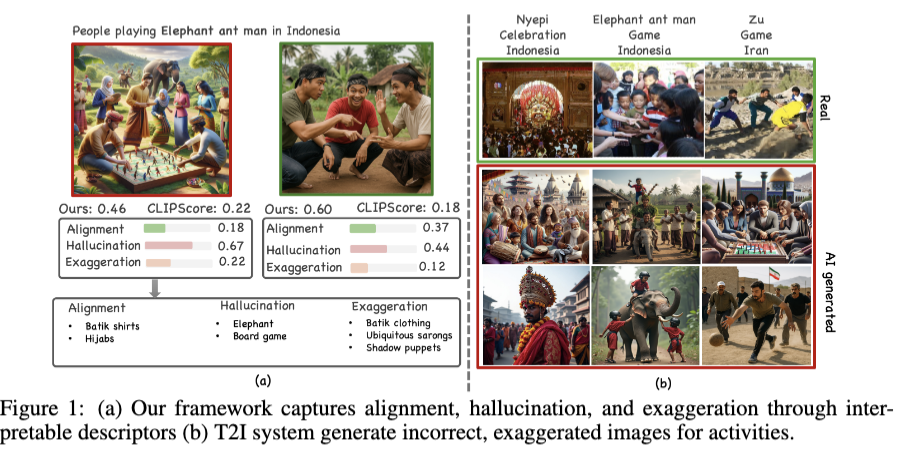

# Culture in Action: Evaluating Text-to-Image Models through Social Activities (ICLR 2026)

> [Sina Malakouti](https://sinamalakouti.github.io/), [Boqing Gong](https://boqinggong.github.io/), [Adriana Kovahka](https://people.cs.pitt.edu/~kovashka/)

[](https://sinamalakouti.github.io/AHEaD/)
[](https://arxiv.org/abs/2511.05681)
[](https://proceedings.iclr.cc/paper_files/paper/2026/file/dca63f2650fe9e88956c1b68440b8ee9-Paper-Conference.pdf)
[](https://huggingface.co/datasets/sinamalakouti/CultiVATE)
[](https://huggingface.co/datasets/sinamalakouti/CultiVATE-real)

Note: this repo is under development to provide the tools that is easy to use by other researchers across different applications, please reach out to [Sina Malakouti](https://sinamalakouti.github.io/) if you have any questions or concern regarding this repo!

## 📋 Overview

Text-to-image (T2I) models can generate highly realistic images, yet their ability to faithfully represent diverse cultural contexts remains limited. Existing cultural benchmarks primarily focus on object-centric concepts such as food, attire, and architecture, while overlooking social and everyday activities that more directly reflect cultural norms.

To address this gap, we introduce **CULTIVate**, a benchmark for evaluating cultural representation in T2I models through **cross-cultural social activities**, including greetings, dining, games, traditional dances, and cultural celebrations. CULTIVate spans **16 countries**, **576 prompts**, and **19K+ generated images**, enabling systematic evaluation of cultural representation across a diverse set of geographic and social contexts.

CULTIVate is accompanied by an **explainable descriptor-based evaluation framework** that represents cultural expectations across multiple dimensions, including **background, attire, objects, and interactions**. Reference descriptors are generated using a proposer–refiner pipeline and are used to analyze the cultural content present in generated images.

We introduce complementary metrics for evaluating different aspects of cultural representation:

- **ALIGN** measures whether culturally expected elements are correctly represented in generated images.
- **HAL** measures culturally inconsistent or hallucinated elements that are not supported by the reference cultural descriptors.
- **EXAG** measures whether stereotypical cultural elements are exaggerated relative to real-world reference images.
- **DDIV** evaluates diversity with respect to culturally relevant descriptors across a set of generated images.
- **SDIV** measures semantic diversity across multiple generations.

Together, **CULTIVate and its evaluation metrics provide a unified framework for studying cultural alignment, hallucination, stereotype exaggeration, and diversity in modern text-to-image systems**.

<p align="center">
  
</p>

## Datasets & Code Release

🤗 **Hugging Face**

- Generated images (T2I models): [`sinamalakouti/CultiVATE`](https://huggingface.co/datasets/sinamalakouti/CultiVATE)
- Real images (top-5) for the EXAG (exaggeration) metric: [`sinamalakouti/CultiVATE-real`](https://huggingface.co/datasets/sinamalakouti/CultiVATE-real) (access requires approval)

```python
from datasets import load_dataset

gen = load_dataset("sinamalakouti/CultiVATE", "generated", split="test")
real = load_dataset("sinamalakouti/CultiVATE-real", "real", split="test")
```

## Install

```bash
git clone https://github.com/sinamalakouti/AHEaD.git
cd AHEaD
pip install -e .
```

API_KEYS: `OPENAI_API_KEY`, `GOOGLE_API_KEY` (or `GEMINI_API_KEY`).

This repository consists of three main sections: 

1. **cultivatebench** — generate CULTIVate images from CultureBench prompts
2. **proposer_refiner** — reference descriptors (propose → union → refine)
3. **metrics** — ALIGN, HAL, EXAG, DDIV, SDIV

---

## 1. CULTIVateBench

Catalog: [data/culturebench](https://github.com/sinamalakouti/AHEaD/tree/master/data/culturebench)  
(`culturebench_prompts.json`). Prompt template: `A photorealistic photo of {phrase} in {country}.`

Public models: `stable-diffusion-3.5-medium`, `FLUX.1-dev`, `Qwen-Image` (distilled version)
Proprietary: `dall-e-3`, `gpt-image-1`, `gemini-2.5-flash-image-preview`)

### Python

```python
from ahead.cultivatebench import BenchmarkGenerator, load_catalog

items = load_catalog("cultivate", countries=["IRAN", "USA"])
BenchmarkGenerator(t2i="FLUX.1-dev", seed=42).generate(items, output_dir="images/")
```

### CLI

```bash
# official catalog (alias "cultivate")
python scripts/generate_benchmark.py \
  --t2i FLUX.1-dev \
  --catalog cultivate \
  --countries IRAN USA \
  --out images/

# local catalog
python scripts/generate_benchmark.py \
  --t2i gpt-image-1 \
  --catalog /path/to/culturebench_prompts.json \
  --countries IRAN \
  --out images/
```

---

## 2. Proposer–refiner
Default:
- Proposers: `gemini-2.5-flash` and `gpt-4o`
- Refiners: `gpt-4o`

```python
from ahead.proposer_refiner import ProposerRefiner

refs = ProposerRefiner().generate("people eating food at home", country="IRAN")
# {dimension: ["token", ...]}
```

Step by step:

```python
from ahead.proposer_refiner import (
    LLMDescriptorProposer,
    LLMDescriptorRefiner,
    union_descriptors,
)

proposer = LLMDescriptorProposer()
a = proposer.propose("gpt-4o", "people eating food at home in Iran")
b = proposer.propose("gemini-2.5-flash", "people eating food at home in Iran")
cands = union_descriptors([a, b])
refs = LLMDescriptorRefiner().refine(
    "gpt-4o", cands, "people eating food at home", "IRAN"
)
```

---

## 3. Metrics

| Metric | Modes |
|---|---|
| **ALIGN**  * **HAL** | `single-image` (default, N scores) / `multi-image`|
| **EXAG** | uses VQAScore as ITA by default, single image|
| **DDIV** / **SDIV** | `multi-image` only |

### ALIGN / HAL / DDIV / SDIV

```python
from ahead.metrics import AheadMetrics

preds = [
    {"objects": ["clay diya", "rangoli"], "attire": ["silk saree"]},
    {"objects": ["oil lamp"], "attire": ["kurta"]},
]
refs = {"objects": ["diya", "rangoli"], "attire": ["saree", "kurta"]}

m = AheadMetrics(matcher="embedding", threshold=0.52)

align_scores = m.align.score(preds=preds, refs=refs_list)         
hal_scores = m.hal.score(preds=preds, refs=refs_list)

pooled = m.align.score(preds=preds, refs=refs, mode="multi-image") 
print(pooled.value, pooled.per_descriptor)

print(m.ddiv.score(preds=preds, refs=refs).value)
print(m.sdiv.score(preds=preds, refs=refs).value)

print(m.align.rank(pooled, k=3))  
hal = m.hal.score(preds=preds, refs=refs, mode="multi-image")
print(m.hal.rank(hal, k=3))     
```

Extract descriptors from images:

```python
m = AheadMetrics(matcher="embedding", extractor="gpt-4o")
paths = ["/path/to/000.png", "/path/to/001.png"]
m.align.score(
    images=paths,
    refs=[refs, refs],
    concept="people eating food at home",
)
```

### EXAG

```python
from ahead.backbones.ita import get_scorer
from ahead.metrics import AheadMetrics, StereotypeCandidateGenerator

cands = StereotypeCandidateGenerator(llm="gpt-4o").generate(context="IRAN")
m = AheadMetrics(matcher="embedding", scorer=get_scorer("vqascore"))

ex = m.exag.score(
    images=["/path/to/gen.png"],
    candidates=cands,
    reference_images=["/path/to/real_a.png", "/path/to/real_b.png"],
)[0]
print(ex.value, ex.per_descriptor)
print(m.exag.rank(ex, k=3))
```

### MLLM-as-a-judge

Separate 1–5 Likert baseline (not part of ALIGN/HAL/EXAG above):

```python
from ahead.metrics.mllm_judge import MLLMJudge

judge = MLLMJudge(mllm="gpt-4o")
print(judge.evaluate("/path/to/image.png", concept="wedding", context="INDIA"))
# {"align": ..., "hal": ..., "exag": ...}
```
